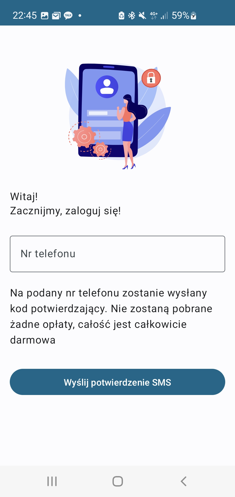

# SportNiteAndroid
<div>


</div>

## About
SportNite Android app written in Kotlin and Jetpack Compose. Connects with GraphQL Server, uses Firebase for Authentication (with Oauth 2)

[](https://github.com/SportNite/SportNiteAndroid/releases/latest)

## Specification
- written in Kotlin and Jetpack Compose
- data is fetched from GraphQL API and cached in memory
- apk is published on Google Play for testers
- Qodana code quality report: https://qodana.cloud/projects/3wwJW/reports/AYKR2

## Libraries used
- Jetpack Compose
- Kotlin Coroutines
- Coroutines Flow
- Orbit MVI
- Apollo GraphQL
- Firebase Auth
- Firebase Storage
- Store
- Hilt
- Coil
- Google Acompanist
- Lottie
- Image Cropper

## Architecture
App is based on MVI pattern. It consists of 3 layers:
- Presentation (ViewModels implementing Orbit MVI containers, UI in Jetpack Compose) - handles interactions with user on particular screens and gets data from repository by use cases
- Domain (Repository) - responsible for business logic
- Data - responsible for accessing data from api or from local storage (in our project memory or SharedPreferences) 

## Code organization
#### `SportNiteAndroid/app/src/main` - package with production code
##### `/graphql` - package with graphql schema (.json extension) and mutations and queries (.graphql extensions)
##### `/res` - package with app resources like icons and images, translated texts
##### `/java/com/pawlowski/sportnite` - package with kotlin code of the app
- `MainActivity.kt` - starting point of the app. Its responsible for displaying navigation composable
- `/di` - package with dependency injection related classes
- `/presentation/view_models_related/{screen}` - package with view models, ui state, side effects for particular screen
- `/presentation/use_cases` - package with use cases
- `/presentation/ui` - package with ui composables
- `/presentation/models` - package with presentation data models
- `/presentation/mappers` - package with functions mapping presentation models to domain models
- `/presentation/domain` - package with repository 
- `/presentation/data/auth` - package with authentication and classes caching user data
- `/presentation/data/firebase_storage` - package with classes uploading user profile image to Firebase Storage
- `/presentation/data/local` - package with classes caching data
- `/presentation/data/mappers` - package with functions mapping graphql models to domain/presentation models
- `/presentation/data/remote` - package with GraphQLService - class responsible with comunication with GraphQL server


#### `SportNiteAndroid/app/src/test` - package with unit tests


## User documentation
User can create offers for sport meetings. Other users than can explore existing offers and accept offer. 
### Create an offer (1)
- ensure you are signed in, if not Login (2)
- go to "Moje spotkania" tab and press "+" button on bottom right corner
- enter date and time
- select sport
- select city
- optionally enter additional informations
- press "Dodaj ofertę"

### Login (2) - if you are not signed yet
- enter phone number
- at next screen, enter confirmation code from SMS and tap "Potwierdź"
- select avatar, type your name and birth date. Select sex and time availability
- next, select in what sports are you interested in
- confirm, and select level of advance in chosen sports 

### View incoming meetings (3)
- tap "Home" tab
- now you can view incoming meetings

### Search for people (4)
- tap "Szukaj ludzi tab"
- use filter to show people only interested in given sport
- after tapping user, you can see his level of advance, phone number and time availability

### Accept offer response (5)
- tap "Moje spotkania"
- select offer
- tap "Akceptuj ofertę" 

### Remove offer (6)
- tap "Moje spotkania"
- select offer
- tap "Usuń ofertę"


## Running
Easiest way to run SportNite Android app is to download apk from Github Releases

## Code quality report
With `qodana` installed:
```bash
qodana scan --show-report
```


## Screenshots

| Home Screen | My Meetings Screen | Sign In Screen |
| :-------- | :------- | :------- |
|  |  |  |

| Choose Sports Screen | Choose Advance Level Screen | Edit Profile Screen |
| :-------- | :------- | :------- |
|  |  |  |

## License
Project is licensed under the BSD 3-clause license. See [LICENSE](https://github.com/SportNite/SportNiteAndroid/blob/master/LICENSE.md) for more details.
